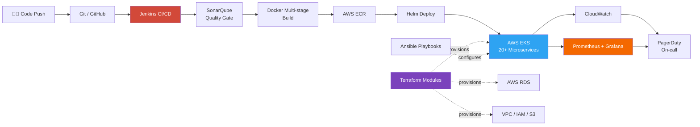

<div align="center">


</div>

<br>

```
$ whoami
aman-jain — Information Systems Engineer (SRE) @ HCLSoftware

$ uptime
4 years, 6+ months | load average: automation, kubernetes, terraform

$ cat mission.txt
Build infrastructure so reliable, nobody remembers it's there.
```

<br>

## 🗺️ Infrastructure Map

Rather than a bullet list, here's how the pieces of my stack actually connect in production — this renders as a live diagram directly on GitHub:



<br>

## 📟 System Metrics — Career Edition

<div align="center">

| Metric | Value | Trend |
|:--|:--:|:--:|
| Production Uptime Maintained | **99.95%** | 🟢 Stable |
| Deployment Cycle Time | **↓ 80%** | 🟢 Improved |
| Infrastructure Cost | **↓ 25%** | 🟢 Optimized |
| Legacy Apps Containerized | **10+** | 🟢 Migrated |
| Microservices Managed (EKS) | **20+** | 🟢 Live |
| Experience | **4.6+ yrs** | 🔵 Growing |

</div>

<br>

## 🧩 Stack Breakdown

<table>
<tr>
<td width="50%" valign="top">

**Orchestration & Containers**

<a href="https://www.docker.com/" target="_blank"></a>
<a href="https://kubernetes.io/" target="_blank"></a>
<a href="https://helm.sh/" target="_blank"></a>
<a href="https://aws.amazon.com/eks/" target="_blank"></a>

[Docker](https://www.docker.com/) · [Docker Compose](https://docs.docker.com/compose/) · [Kubernetes](https://kubernetes.io/) · [AWS EKS](https://aws.amazon.com/eks/) · [Helm](https://helm.sh/) · Container Registries

</td>
<td width="50%" valign="top">

**CI/CD & GitOps**

<a href="https://www.jenkins.io/" target="_blank"></a>
<a href="https://git-scm.com/" target="_blank"></a>
<a href="https://github.com/features/actions" target="_blank"></a>
<a href="https://www.sonarsource.com/products/sonarqube/" target="_blank"></a>

[Jenkins](https://www.jenkins.io/) · [Git](https://git-scm.com/) · [GitHub Actions](https://github.com/features/actions) · GitFlow · [SonarQube](https://www.sonarsource.com/products/sonarqube/) Gates

</td>
</tr>
<tr>
<td width="50%" valign="top">

**Cloud — AWS**

<a href="https://aws.amazon.com/ec2/" target="_blank"></a>
<a href="https://aws.amazon.com/s3/" target="_blank"></a>
<a href="https://aws.amazon.com/rds/" target="_blank"></a>
<a href="https://aws.amazon.com/lambda/" target="_blank"></a>

[EC2](https://aws.amazon.com/ec2/) · [S3](https://aws.amazon.com/s3/) · [VPC](https://aws.amazon.com/vpc/) · [IAM](https://aws.amazon.com/iam/) · [RDS](https://aws.amazon.com/rds/) · [Lambda](https://aws.amazon.com/lambda/) · [Route 53](https://aws.amazon.com/route53/) · Auto Scaling · [CloudWatch](https://aws.amazon.com/cloudwatch/)

</td>
<td width="50%" valign="top">

**IaC & Scripting**

<a href="https://www.terraform.io/" target="_blank"></a>
<a href="https://www.ansible.com/" target="_blank"></a>
<a href="https://www.gnu.org/software/bash/" target="_blank"></a>
<a href="https://www.python.org/" target="_blank"></a>

[Terraform](https://www.terraform.io/) Modules · [Ansible](https://www.ansible.com/) Playbooks · [Bash](https://www.gnu.org/software/bash/) · [Python](https://www.python.org/)

</td>
</tr>
<tr>
<td width="50%" valign="top">

**Observability**

<a href="https://prometheus.io/" target="_blank"></a>
<a href="https://grafana.com/" target="_blank"></a>
<a href="https://www.dynatrace.com/" target="_blank"></a>
<a href="https://www.pagerduty.com/" target="_blank"></a>

[Prometheus](https://prometheus.io/) · [Grafana](https://grafana.com/) · [Dynatrace](https://www.dynatrace.com/) · [CloudWatch](https://aws.amazon.com/cloudwatch/) · [PagerDuty](https://www.pagerduty.com/)

</td>
<td width="50%" valign="top">

**Systems**

<a href="https://www.linux.org/" target="_blank"></a>
<a href="https://ubuntu.com/" target="_blank"></a>
<a href="https://www.redhat.com/en/technologies/linux-platforms/enterprise-linux" target="_blank"></a>
<a href="https://www.centos.org/" target="_blank"></a>

[Linux](https://www.linux.org/) Admin · [Ubuntu](https://ubuntu.com/) · [RHEL](https://www.redhat.com/en/technologies/linux-platforms/enterprise-linux)/[CentOS](https://www.centos.org/) · systemd · Cron · Perf Tuning

</td>
</tr>
</table>

<sub>Every icon above links straight to the tool's official site.</sub>

<br>

## 🎖️ Verified Certifications

<div align="center">

<a href="https://www.credly.com/badges/2ec3c896-02d9-4347-9d4f-ad8cf1f4549b"></a>
<a href="https://www.credly.com/badges/03cf1e11-6e67-4997-9a6c-6b19e674bb06"></a>
<a href="https://www.credly.com/badges/07260c99-7c24-45a5-9ae8-f4891d25c0ac"></a>
<a href="https://www.credly.com/badges/0881ca50-6903-4071-8bcd-9a68037ab5a1"></a>
<a href="https://www.credly.com/badges/70b7e266-6b7f-4733-875f-6e2826268090"></a>
<a href="https://www.credly.com/badges/79d42eca-a94e-46fe-9658-b60b0fa7fb19"></a>
<a href="https://www.credly.com/badges/44247c98-5732-4c44-8f54-f1636440f198"></a>
<a href="https://www.credly.com/badges/4376db7d-78fb-42bb-9084-dcd0f1f136d4"></a>

</div>

| Certification | Issuer |
|:--|:--|
| [AWS Certified CloudOps Engineer – Associate](https://www.credly.com/badges/2ec3c896-02d9-4347-9d4f-ad8cf1f4549b) | Amazon Web Services |
| [AWS Certified Solutions Architect – Associate](https://www.credly.com/badges/03cf1e11-6e67-4997-9a6c-6b19e674bb06) | Amazon Web Services |
| [AWS Certified AI Practitioner](https://www.credly.com/badges/07260c99-7c24-45a5-9ae8-f4891d25c0ac) · [Early Adopter](https://www.credly.com/badges/79d42eca-a94e-46fe-9658-b60b0fa7fb19) | Amazon Web Services |
| [AWS Certified Cloud Practitioner](https://www.credly.com/badges/0881ca50-6903-4071-8bcd-9a68037ab5a1) | Amazon Web Services |
| [AWS Partner: Technical Accredited](https://www.credly.com/badges/70b7e266-6b7f-4733-875f-6e2826268090) | Amazon Web Services |
| [LFS158: Introduction to Kubernetes](https://www.credly.com/badges/44247c98-5732-4c44-8f54-f1636440f198) | The Linux Foundation |
| [Cloud Digital Leader Certification](https://www.credly.com/badges/4376db7d-78fb-42bb-9084-dcd0f1f136d4) | Google Cloud |

<br>

## 📌 Featured Deployment

<div align="center">

[](https://github.com/imaman4000/speedex_courier)

</div>

<p align="center"><i>Java · JSP/Servlets · MySQL — booking, tracking, and admin workflows for a courier management system.</i></p>

<br>

## 📊 Live Telemetry

<div align="center">


</div>

<details>
<summary><b>🐍 Contribution Snake (set up once, updates itself)</b></summary>
<br>

This is a rarely-used but genuinely cool GitHub feature: a GitHub Action eats your own contribution graph like a snake game and commits the animation back into your repo automatically, so it's always fresh.

1. Create `.github/workflows/snake.yml` in the `imaman4000/imaman4000` repo with the [Platane/snk](https://github.com/Platane/snk) action.
2. It generates `github-contribution-grid-snake.svg` on a schedule.
3. Embed it here:

```md

```

</details>

<br>

## 📮 Incident Response (a.k.a. Contact)

<div align="center">

<a href="https://www.linkedin.com/in/aman-jain-973b151b7/" target="_blank"></a>
<a href="mailto:amanjain15799@gmail.com?subject=Let%27s%20Connect&body=Hi%20Aman%2C%0A%0A" target="_blank"></a>
<a href="https://mail.google.com/mail/?view=cm&fs=1&to=amanjain15799@gmail.com&su=Let%27s%20Connect" target="_blank"></a>

</div>

<p align="center"><sub>The first button opens your default mail app; the second opens Gmail directly in your browser with the message pre-addressed — use whichever actually works on your machine.</sub></p>

<br>

<div align="center">
<i>postmortem.log → "No root cause found. System performed exactly as designed: reliably, and without drama."</i>
</div>


